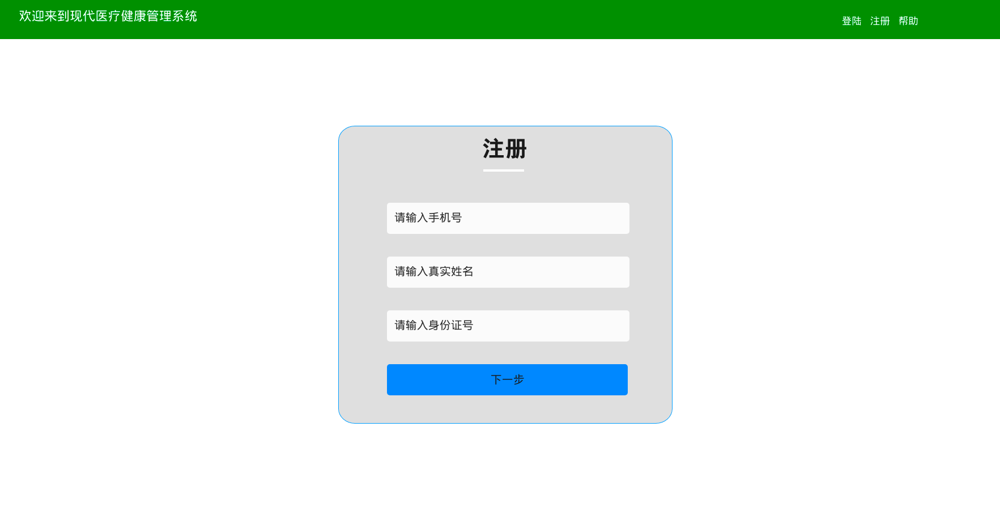
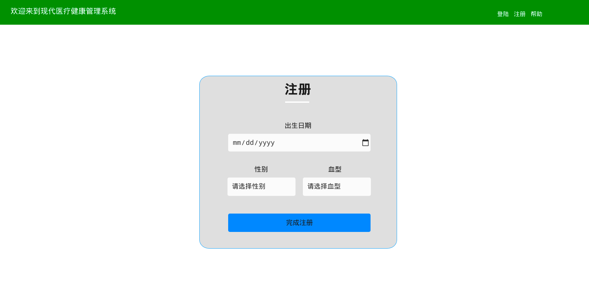
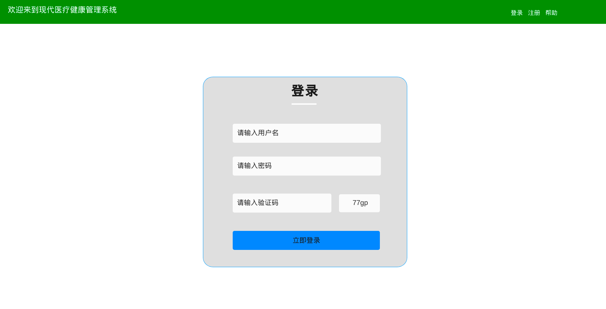

# 现代医疗管理系统 

## 通用使用帮助

访问本系统，在完整支持html5/css3的浏览器中，您可以看到以下主页界面：

在中央区域播放的是一段简单的css动画，您不需要其它的流解码插件就可以看到此动画。

#### 主页

点击左上角“欢迎来到现代医疗管理系统”，可以从其它页面返回该主页面。

#### 功能区

您可以看到三个功能按钮，分别为“登录”，“注册”和“帮助”。

在您使用本系统前，您需要进行注册操作，注册将创建一个您用于登录本系统的帐号。

如果您已经完成过注册操作，请登录进入本系统。

在任何页面，点击“帮助”按钮都会使您跳转到相关的帮助界面。

#### 如何注册

首先，单击“注册”按钮，您将看到以下页面：

您需要按要求正确填写每一项内容，逐步完成个人信息的填写。

在第一个界面，您需要为您自己设置一个唯一的用户名（该用户名只用于区分您和他人的身份，不需要是您的真实姓名）和密码。

在设置密码完毕之后，请在下面的“请确认密码”输入框中再次输入上述密码，以确保您的密码输入无误。您应该牢记此密码。

设置完毕后，点击“下一步”，看到第二个界面：

请按提示在三个输入框中分别输入您的手机号、真实姓名和身份证号，务必确认您的个人身份信息正确。

完成后，点击“下一步”，看到第三个界面：

以上信息非必要个人信息，填写完毕后，点击“完成注册”，即可完成注册流程。

#### 如何登录

单击“登录”按钮，进入下图所示页面：

按要求输入用户名、密码以及验证码，单击“立即登录”，若登录成功则可跳转进入本系统其它页面。

如果您在上述流程中遇到了问题，请联系客服工作人员。

联系方式：

- 电邮： sample@server.domain
- 电话：114514
